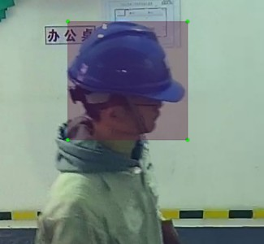
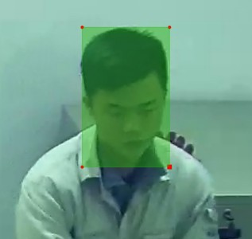
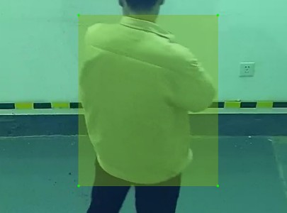
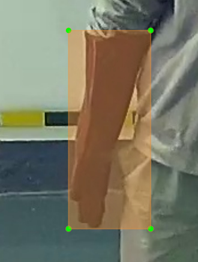
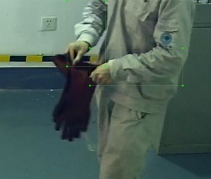
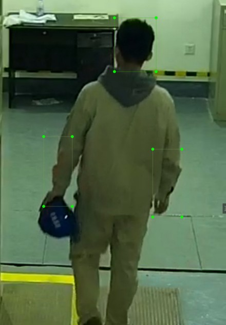

## 视频标注要求

所有视频如下，命名格式为 `{数字}_{类别}_{数字}.mp4`，命名中的`{类别}`指视频中正确的着装任务。

```
.
├── 1_coat_0001.mp4
├── 1_coat_0002.mp4
├── 1_helmet_0002.mp4
├── 1_helmet_0003.mp4
├── 1_helmet_coat_0003.mp4
├── 1_helmet_coat_0004.mp4
├── 1_helmet_coat_glove_0001.mp4
├── 1_helmet_coat_glove_0002.mp4
├── 1_helmet_coat_glove_0003.mp4
├── 1_helmet_glove_0002.mp4
├── 3_coat_0001.mp4
├── 3_glove_0001.mp4
├── 3_helmet_0001.mp4
├── 3_helmet_coat_0001.mp4
└── 3_helmet_glove_0001.mp4
```

### 类别

着装任务分为如下六个类别

- 正确佩戴安全帽：helmet

  

- 未正确佩戴安全帽：nohelmet

  

- 正确穿着工作服：coat

  

- 未正确穿着工作服：nocoat

  

- 正确佩戴绝缘手套：glove

  

- 未正确佩戴绝缘手套：noglove

  

所有类别为

| helmet | nohelmet | coat | nocoat | glove | noglove |
|--------|----------|------|--------|-------|---------|

### 要求

提供的压缩包结构如下

```shell
.
└── X
    ├── {数字}_{类别}_{数字}.mp4	# 原视频文件
    ├── ....mp4					
    ├── images					# 截取的视频帧
	│   └── ...
	└── labels					# 标注信息保存目录
```

对`images`目录下的所有图片使用 LabelImg 工具标注，以 YOLO 数据集标注格式 `.txt`，保存到 labels 目录中，标注需要包含目标物体的整体边缘，noglove
类别标注要包括人员的整个手部和小臂


> LabelImg 官方仓库 https://github.com/heartexlabs/labelImg
>
> Yolo标注工具-labelImg的详细使用 https://blog.csdn.net/klaus_x/article/details/106854136

### 困难情况

只要安全帽或绝缘手套没有正确佩戴，就不标注安全帽或绝缘手套，只标注人员身上穿戴的物品。

如下所示的情况都不标注

- 没有人员，不标注
  


- 穿戴中，不标注手套，只标注 未正确佩戴绝缘手套 noglove
  


- 不标注安全帽，只标注 未正确佩戴安全帽 nohelmet，未正确佩戴绝缘手套 noglove
  
